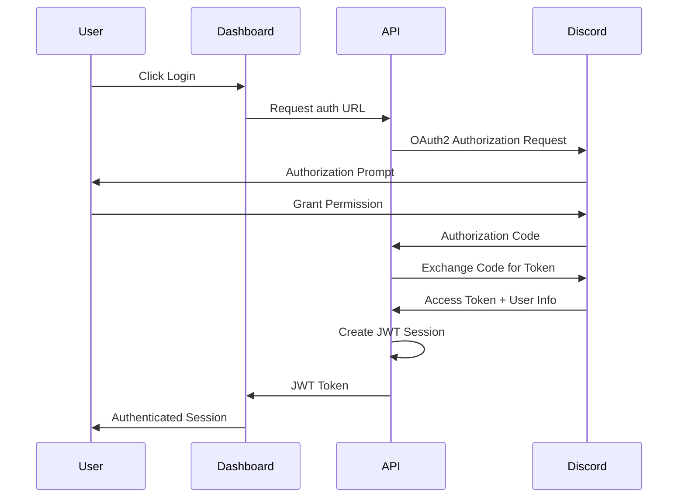

# Authentication System

## Overview

The Guardian Angel League bot implements a comprehensive authentication and authorization system based on Discord OAuth2 and JWT tokens. This system provides secure user identity verification, session management, and role-based access control across all system components.

## Authentication Flow

### Discord OAuth2 Integration

The authentication system leverages Discord's OAuth2 API to verify user identities and manage access to Discord-specific resources.



### Implementation Details

#### OAuth2 Configuration
```python
# Discord OAuth2 Configuration
DISCORD_CLIENT_ID = os.getenv("DISCORD_CLIENT_ID")
DISCORD_CLIENT_SECRET = os.getenv("DISCORD_CLIENT_SECRET")
DISCORD_REDIRECT_URI = os.getenv("DISCORD_REDIRECT_URI")
DISCORD_SCOPE = "identify guilds"

# OAuth2 Endpoints
DISCORD_AUTH_URL = "https://discord.com/api/oauth2/authorize"
DISCORD_TOKEN_URL = "https://discord.com/discord.com/api/oauth2/token"
DISCORD_USER_INFO_URL = "https://discord.com/api/users/@me"
```

#### Authentication Service
```python
# Authentication Service Implementation
class AuthenticationService:
    """Handle Discord OAuth2 authentication and JWT token management"""
    
    def __init__(self):
        self.client_id = DISCORD_CLIENT_ID
        self.client_secret = DISCORD_CLIENT_SECRET
        self.redirect_uri = DISCORD_REDIRECT_URI
        self.jwt_secret = os.getenv("JWT_SECRET_KEY")
    
    async def get_auth_url(self, state: str = None) -> str:
        """Generate Discord OAuth2 authorization URL"""
        
        params = {
            "client_id": self.client_id,
            "redirect_uri": self.redirect_uri,
            "response_type": "code",
            "scope": DISCORD_SCOPE,
        }
        
        if state:
            params["state"] = state
        
        query_string = urlencode(params)
        return f"{DISCORD_AUTH_URL}?{query_string}"
    
    async def exchange_code_for_token(self, code: str) -> dict:
        """Exchange authorization code for Discord access token"""
        
        data = {
            "client_id": self.client_id,
            "client_secret": self.client_secret,
            "grant_type": "authorization_code",
            "code": code,
            "redirect_uri": self.redirect_uri,
        }
        
        headers = {"Content-Type": "application/x-www-form-urlencoded"}
        
        async with httpx.AsyncClient() as client:
            response = await client.post(
                DISCORD_TOKEN_URL,
                data=data,
                headers=headers
            )
            response.raise_for_status()
            return response.json()
    
    async def get_user_info(self, access_token: str) -> dict:
        """Get user information from Discord API"""
        
        headers = {"Authorization": f"Bearer {access_token}"}
        
        async with httpx.AsyncClient() as client:
            response = await client.get(
                DISCORD_USER_INFO_URL,
                headers=headers
            )
            response.raise_for_status()
            return response.json()
    
    async def create_jwt_token(self, user_info: dict, guild_id: str) -> str:
        """Create JWT token for authenticated user"""
        
        payload = {
            "sub": user_info["id"],
            "username": user_info["username"],
            "discriminator": user_info["discriminator"],
            "avatar": user_info.get("avatar"),
            "guild_id": guild_id,
            "roles": await self.get_user_roles(user_info["id"], guild_id),
            "iat": datetime.utcnow(),
            "exp": datetime.utcnow() + timedelta(hours=1),
            "aud": "gal-dashboard"
        }
        
        return jwt.encode(payload, self.jwt_secret, algorithm="HS256")
    
    async def verify_jwt_token(self, token: str) -> dict:
        """Verify and decode JWT token"""
        
        try:
            payload = jwt.decode(
                token,
                self.jwt_secret,
                algorithms=["HS256"],
                audience="gal-dashboard"
            )
            return payload
        except jwt.ExpiredSignatureError:
            raise AuthenticationError("Token has expired")
        except jwt.InvalidTokenError:
            raise AuthenticationError("Invalid token")
```

## JWT Token Management

### Token Structure
```json
{
  "sub": "123456789012345678",
  "username": "player123",
  "discriminator": "1337",
  "avatar": "a_abcdef123456",
  "guild_id": "987654321098765432",
  "roles": ["member", "graphics_editor"],
  "iat": 1642694400,
  "exp": 1642698000,
  "aud": "gal-dashboard"
}
```

### Token Security Features

#### Short Expiration Times
- **Access Tokens**: 1 hour expiration
- **Refresh Tokens**: 24 hours expiration
- **Automatic Rotation**: Tokens refreshed on valid requests

#### Secure Signing
- **Algorithm**: HS256 with HMAC
- **Secret Key**: Environment-specific, regularly rotated
- **Audience Validation**: Prevents token reuse across applications

#### Token Validation
```python
# Token validation middleware
class JWTAuthMiddleware:
    """JWT authentication middleware for FastAPI"""
    
    def __init__(self, app: FastAPI):
        self.app = app
        self.auth_service = AuthenticationService()
    
    async def __call__(self, scope: Scope, receive: Receive, send: Send):
        """Process incoming requests with JWT validation"""
        
        if scope["type"] == "http":
            # Extract token from Authorization header
            headers = dict(scope["headers"])
            auth_header = headers.get(b"authorization", b"").decode()
            
            if auth_header.startswith("Bearer "):
                token = auth_header[7:]
                
                try:
                    # Verify and decode token
                    payload = await self.auth_service.verify_jwt_token(token)
                    
                    # Add user info to request scope
                    scope["user"] = payload
                    
                except AuthenticationError:
                    # Return 401 Unauthorized
                    response = JSONResponse(
                        status_code=401,
                        content={"detail": "Invalid or expired token"}
                    )
                    await response(scope, receive, send)
                    return
        
        # Continue with request processing
        await self.app(scope, receive, send)
```

## Role-Based Access Control (RBAC)

### Role Hierarchy

#### Discord Roles Mapping
```python
# Discord role mapping to GAL roles
DISCORD_ROLE_MAPPING = {
    "@everyone": "guest",
    "Member": "member",
    "Graphics Editor": "graphics_editor",
    "Moderator": "moderator", 
    "Admin": "admin",
    "Tournament Manager": "tournament_manager"
}
```

#### GAL Role Definitions
```python
# GAL role definitions with permissions
GAL_ROLES = {
    "guest": {
        "permissions": ["read:graphics", "read:standings"],
        "description": "Read-only access to public content"
    },
    "member": {
        "permissions": [
            "read:graphics", "write:graphics", "read:standings",
            "read:tournaments"
        ],
        "description": "Basic member with graphic creation access"
    },
    "graphics_editor": {
        "permissions": [
            "read:graphics", "write:graphics", "delete:graphics",
            "read:standings", "manage:canvas"
        ],
        "description": "Advanced graphic editing and management"
    },
    "moderator": {
        "permissions": [
            "read:graphics", "write:graphics", "delete:graphics",
            "read:standings", "write:standings", "read:tournaments",
            "write:tournaments", "manage:users", "manage:canvas"
        ],
        "description": "Full content management capabilities"
    },
    "admin": {
        "permissions": [
            "read:graphics", "write:graphics", "delete:graphics",
            "read:standings", "write:standings", "read:tournaments",
            "write:tournaments", "manage:users", "manage:canvas",
            "system:config", "system:logs", "manage:permissions"
        ],
        "description": "Full system administration"
    },
    "tournament_manager": {
        "permissions": [
            "read:graphics", "write:graphics", "read:standings",
            "write:standings", "read:tournaments", "write:tournaments",
            "manage:tournament_data"
        ],
        "description": "Tournament data management"
    }
}
```

### Permission System

#### Permission Checking
```python
# Permission checking utilities
class PermissionChecker:
    """Check user permissions based on roles"""
    
    def __init__(self, user_roles: list):
        self.user_roles = user_roles
        self.permissions = self._aggregate_permissions()
    
    def _aggregate_permissions(self) -> set:
        """Aggregate permissions from all user roles"""
        
        permissions = set()
        for role in self.user_roles:
            if role in GAL_ROLES:
                permissions.update(GAL_ROLES[role]["permissions"])
        
        return permissions
    
    def has_permission(self, permission: str) -> bool:
        """Check if user has specific permission"""
        return permission in self.permissions
    
    def has_any_permission(self, permissions: list) -> bool:
        """Check if user has any of the specified permissions"""
        return any(perm in self.permissions for perm in permissions)
    
    def has_all_permissions(self, permissions: list) -> bool:
        """Check if user has all specified permissions"""
        return all(perm in self.permissions for perm in permissions)
```

#### Authorization Decorator
```python
# Authorization decorator for FastAPI endpoints
def require_permission(permission: str):
    """Decorator to require specific permission for endpoint"""
    
    def decorator(func):
        @wraps(func)
        async def wrapper(*args, **kwargs):
            # Get user from request
            request = kwargs.get("request")
            if not request or not hasattr(request, "user"):
                raise HTTPException(
                    status_code=401,
                    detail="Authentication required"
                )
            
            # Check permission
            user_roles = request.user.get("roles", [])
            permission_checker = PermissionChecker(user_roles)
            
            if not permission_checker.has_permission(permission):
                raise HTTPException(
                    status_code=403,
                    detail="Insufficient permissions"
                )
            
            # Call original function
            return await func(*args, **kwargs)
        
        return wrapper
    return decorator

# Usage example
@app.get("/api/graphics")
@require_permission("read:graphics")
async def get_graphics(request: Request):
    """Get graphics list - requires read:graphics permission"""
    pass

@app.post("/api/graphics")
@require_permission("write:graphics")
async def create_graphic(request: Request, graphic: GraphicCreate):
    """Create graphic - requires write:graphics permission"""
    pass
```

## Session Management

### Session Storage
```python
# Session management implementation
class SessionManager:
    """Manage user sessions and tokens"""
    
    def __init__(self):
        self.redis_client = redis.Redis(
            host=os.getenv("REDIS_HOST", "localhost"),
            port=int(os.getenv("REDIS_PORT", 6379)),
            db=int(os.getenv("REDIS_DB", 0))
        )
        self.session_ttl = 3600  # 1 hour
    
    async def create_session(self, user_id: str, token_data: dict) -> str:
        """Create new user session"""
        
        session_id = str(uuid.uuid4())
        session_data = {
            "user_id": user_id,
            "token_data": token_data,
            "created_at": datetime.utcnow().isoformat(),
            "last_activity": datetime.utcnow().isoformat()
        }
        
        # Store session in Redis
        await self.redis_client.setex(
            f"session:{session_id}",
            self.session_ttl,
            json.dumps(session_data)
        )
        
        return session_id
    
    async def get_session(self, session_id: str) -> dict:
        """Get session data"""
        
        session_data = await self.redis_client.get(f"session:{session_id}")
        
        if not session_data:
            return None
        
        return json.loads(session_data)
    
    async def update_session_activity(self, session_id: str):
        """Update session last activity"""
        
        session_data = await self.get_session(session_id)
        
        if session_data:
            session_data["last_activity"] = datetime.utcnow().isoformat()
            
            # Update session with new TTL
            await self.redis_client.setex(
                f"session:{session_id}",
                self.session_ttl,
                json.dumps(session_data)
            )
    
    async def invalidate_session(self, session_id: str):
        """Invalidate user session"""
        
        await self.redis_client.delete(f"session:{session_id}")
    
    async def invalidate_user_sessions(self, user_id: str):
        """Invalidate all sessions for a user"""
        
        # Get all user sessions
        pattern = f"session:*"
        sessions = await self.redis_client.keys(pattern)
        
        for session_key in sessions:
            session_data = await self.redis_client.get(session_key)
            if session_data:
                data = json.loads(session_data)
                if data.get("user_id") == user_id:
                    await self.redis_client.delete(session_key)
```

### Token Refresh
```python
# Token refresh implementation
class TokenRefreshService:
    """Handle JWT token refresh"""
    
    def __init__(self):
        self.auth_service = AuthenticationService()
        self.session_manager = SessionManager()
    
    async def refresh_token(self, refresh_token: str) -> dict:
        """Refresh access token using refresh token"""
        
        try:
            # Verify refresh token
            payload = await self.auth_service.verify_jwt_token(refresh_token)
            
            # Check if session is still valid
            session_data = await self.session_manager.get_session(
                payload.get("session_id")
            )
            
            if not session_data:
                raise AuthenticationError("Session expired")
            
            # Create new access token
            new_access_token = await self.auth_service.create_jwt_token(
                {
                    "id": payload["sub"],
                    "username": payload["username"],
                    "discriminator": payload["discriminator"],
                    "avatar": payload.get("avatar")
                },
                payload["guild_id"]
            )
            
            # Update session activity
            await self.session_manager.update_session_activity(
                payload["session_id"]
            )
            
            return {
                "access_token": new_access_token,
                "refresh_token": refresh_token,
                "token_type": "bearer",
                "expires_in": 3600
            }
            
        except Exception as e:
            raise AuthenticationError(f"Token refresh failed: {str(e)}")
```

## Security Features

### Rate Limiting
```python
# Authentication rate limiting
class AuthRateLimiter:
    """Rate limiting for authentication endpoints"""
    
    def __init__(self):
        self.redis_client = redis.Redis()
        self.limits = {
            "login": {"requests": 5, "window": 300},  # 5 per 5 minutes
            "token_refresh": {"requests": 10, "window": 300},  # 10 per 5 minutes
            "password_reset": {"requests": 3, "window": 3600}  # 3 per hour
        }
    
    async def check_rate_limit(self, action: str, identifier: str) -> bool:
        """Check if action is within rate limit"""
        
        if action not in self.limits:
            return True
        
        limit_config = self.limits[action]
        key = f"rate_limit:{action}:{identifier}"
        
        # Get current count
        current_count = await self.redis_client.get(key)
        current_count = int(current_count) if current_count else 0
        
        if current_count >= limit_config["requests"]:
            return False
        
        # Increment counter
        await self.redis_client.incr(key)
        await self.redis_client.expire(key, limit_config["window"])
        
        return True
```

### Security Monitoring
```python
# Authentication security monitoring
class AuthSecurityMonitor:
    """Monitor authentication security events"""
    
    def __init__(self):
        self.logger = logging.getLogger("auth_security")
        self.suspicious_activities = {}
    
    async def log_login_attempt(self, user_id: str, ip: str, success: bool):
        """Log login attempts and detect suspicious patterns"""
        
        event = {
            "event_type": "login_attempt",
            "user_id": user_id,
            "ip_address": ip,
            "success": success,
            "timestamp": datetime.utcnow().isoformat()
        }
        
        if success:
            self.logger.info(f"Successful login: {event}")
        else:
            self.logger.warning(f"Failed login attempt: {event}")
            
            # Track failed attempts for brute force detection
            await self.track_failed_attempts(ip, user_id)
    
    async def track_failed_attempts(self, ip: str, user_id: str):
        """Track failed login attempts for security analysis"""
        
        key = f"failed_attempts:{ip}:{user_id}"
        attempts = await self.redis_client.incr(key)
        await self.redis_client.expire(key, 3600)  # 1 hour window
        
        if attempts > 5:
            # Flag as suspicious activity
            await self.flag_suspicious_activity(
                "brute_force_attempt",
                {"ip": ip, "user_id": user_id, "attempts": attempts}
            )
    
    async def flag_suspicious_activity(self, activity_type: str, details: dict):
        """Flag and log suspicious activity"""
        
        event = {
            "event_type": "suspicious_activity",
            "activity_type": activity_type,
            "details": details,
            "timestamp": datetime.utcnow().isoformat()
        }
        
        self.logger.critical(f"Suspicious activity detected: {event}")
        
        # Send security alert
        await self.send_security_alert(event)
    
    async def send_security_alert(self, event: dict):
        """Send security alert to administrators"""
        
        alert_message = f"""
        SECURITY ALERT
        
        Event Type: {event['activity_type']}
        Timestamp: {event['timestamp']}
        Details: {event['details']}
        
        Immediate investigation required.
        """
        
        # Send to security channel/log
        self.logger.critical(alert_message)
```

## Configuration and Environment

### Environment Variables
```bash
# Discord OAuth2 Configuration
DISCORD_CLIENT_ID=your_discord_client_id
DISCORD_CLIENT_SECRET=your_discord_client_secret_here
DISCORD_REDIRECT_URI=https://your-domain.com/auth/callback

# JWT Configuration
JWT_SECRET_KEY=your_jwt_secret_key_here
JWT_ALGORITHM=HS256

# Redis Configuration (for sessions)
REDIS_HOST=localhost
REDIS_PORT=6379
REDIS_DB=0

# Security Configuration
CORS_ORIGINS=https://your-domain.com
SESSION_TIMEOUT=3600
RATE_LIMIT_ENABLED=true
```

### Security Best Practices

#### Production Configuration
```python
# Production security configuration
class SecurityConfig:
    """Security configuration for production"""
    
    # JWT Configuration
    JWT_SECRET_KEY = os.getenv("JWT_SECRET_KEY")
    JWT_ALGORITHM = "HS256"
    JWT_ACCESS_TOKEN_EXPIRE_MINUTES = 60
    JWT_REFRESH_TOKEN_EXPIRE_DAYS = 7
    
    # Session Configuration
    SESSION_TIMEOUT = 3600  # 1 hour
    MAX_CONCURRENT_SESSIONS = 3
    
    # Rate Limiting
    RATE_LIMIT_LOGIN_ATTEMPTS = 5
    RATE_LIMIT_LOGIN_WINDOW = 300  # 5 minutes
    RATE_LIMIT_TOKEN_REFRESH = 10
    RATE_LIMIT_REFRESH_WINDOW = 300
    
    # Security Headers
    SECURITY_HEADERS = {
        "X-Content-Type-Options": "nosniff",
        "X-Frame-Options": "DENY",
        "X-XSS-Protection": "1; mode=block",
        "Strict-Transport-Security": "max-age=31536000; includeSubDomains"
    }
```

## Error Handling

### Authentication Errors
```python
# Custom authentication exceptions
class AuthenticationError(Exception):
    """Base authentication error"""
    pass

class TokenExpiredError(AuthenticationError):
    """Token has expired"""
    pass

class InvalidTokenError(AuthenticationError):
    """Invalid token"""
    pass

class InsufficientPermissionsError(AuthenticationError):
    """User lacks required permissions"""
    pass

class RateLimitExceededError(AuthenticationError):
    """Rate limit exceeded"""
    pass

# Error handling middleware
class AuthErrorHandler:
    """Handle authentication errors gracefully"""
    
    @staticmethod
    def handle_auth_error(error: AuthenticationError) -> HTTPException:
        """Convert authentication errors to HTTP responses"""
        
        error_mapping = {
            TokenExpiredError: (401, "Token has expired"),
            InvalidTokenError: (401, "Invalid authentication token"),
            InsufficientPermissionsError: (403, "Insufficient permissions"),
            RateLimitExceededError: (429, "Rate limit exceeded"),
            AuthenticationError: (401, "Authentication failed")
        }
        
        status_code, detail = error_mapping.get(
            type(error), (500, "Internal authentication error")
        )
        
        return HTTPException(status_code=status_code, detail=detail)
```

## Testing

### Authentication Testing
```python
# Authentication testing utilities
class AuthTestSuite:
    """Test suite for authentication system"""
    
    def __init__(self):
        self.auth_service = AuthenticationService()
        self.test_user_id = "test_user_123"
        self.test_guild_id = "test_guild_456"
    
    async def test_oauth_flow(self):
        """Test complete OAuth2 flow"""
        
        # Test auth URL generation
        auth_url = await self.auth_service.get_auth_url("test_state")
        assert "client_id" in auth_url
        assert "redirect_uri" in auth_url
        assert "state=test_state" in auth_url
        
        # Mock token exchange
        with patch('httpx.AsyncClient.post') as mock_post:
            mock_post.return_value.json.return_value = {
                "access_token": "test_access_token",
                "token_type": "Bearer"
            }
            
            token_data = await self.auth_service.exchange_code_for_token("test_code")
            assert "access_token" in token_data
    
    async def test_jwt_tokens(self):
        """Test JWT token creation and validation"""
        
        # Create test token
        user_info = {
            "id": self.test_user_id,
            "username": "testuser",
            "discriminator": "1234"
        }
        
        token = await self.auth_service.create_jwt_token(
            user_info, 
            self.test_guild_id
        )
        
        assert isinstance(token, str)
        
        # Validate token
        payload = await self.auth_service.verify_jwt_token(token)
        assert payload["sub"] == self.test_user_id
        assert payload["guild_id"] == self.test_guild_id
    
    async def test_permission_system(self):
        """Test role-based permission system"""
        
        # Test permission aggregation
        user_roles = ["member", "graphics_editor"]
        permission_checker = PermissionChecker(user_roles)
        
        assert permission_checker.has_permission("read:graphics")
        assert permission_checker.has_permission("write:graphics")
        assert not permission_checker.has_permission("system:config")
        
        # Test permission decorator
        @require_permission("write:graphics")
        async def test_endpoint(request):
            return {"success": True}
        
        # Create mock request with user
        mock_request = Mock()
        mock_request.user = {
            "sub": self.test_user_id,
            "roles": user_roles
        }
        
        result = await test_endpoint(request=mock_request)
        assert result["success"] is True
```

---

**System Version**: 1.0  
**Last Updated**: 2025-01-18  
**Related Documentation**: [Security Architecture](./security-architecture.md), [Dashboard Security SOP](../sops/dashboard-security.md)
